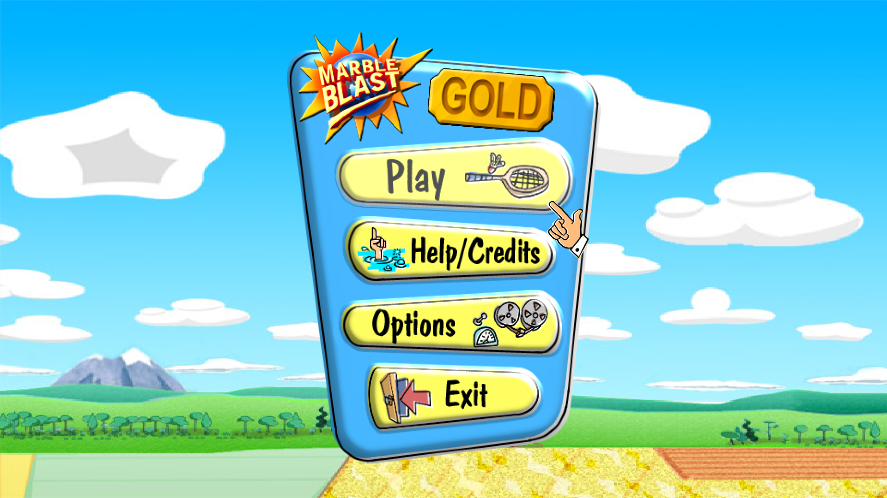
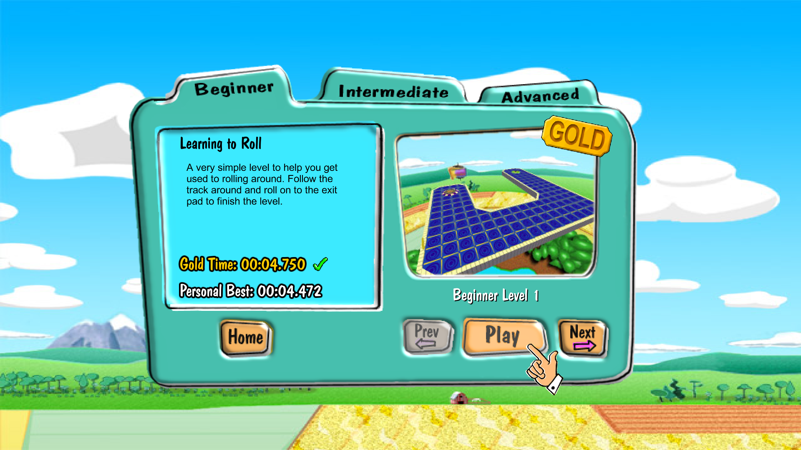
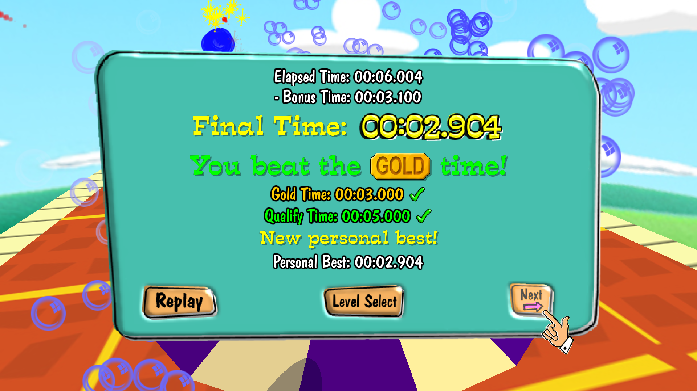
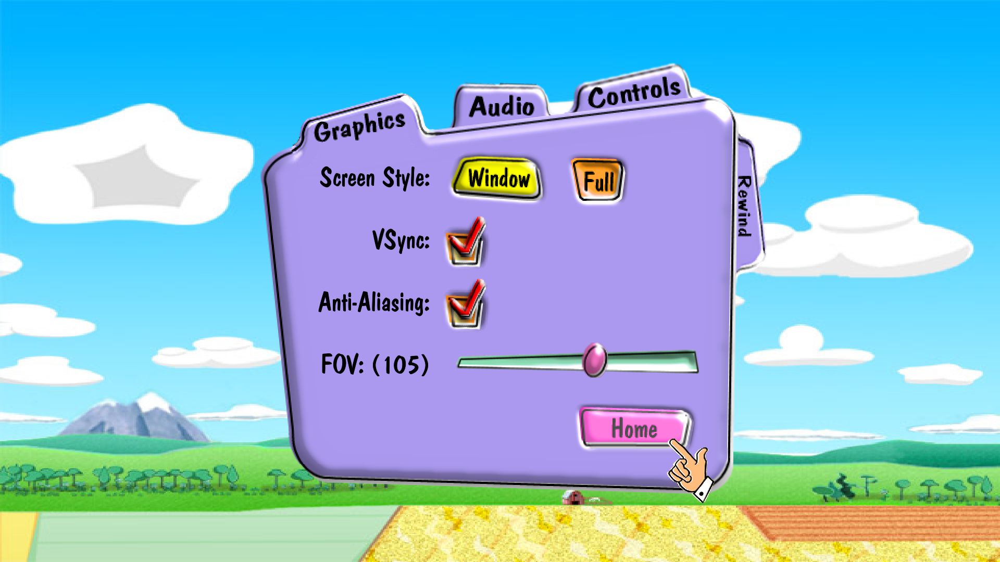
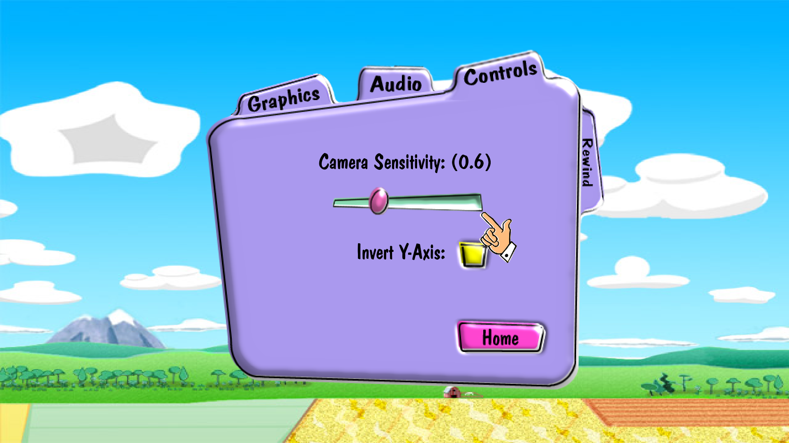
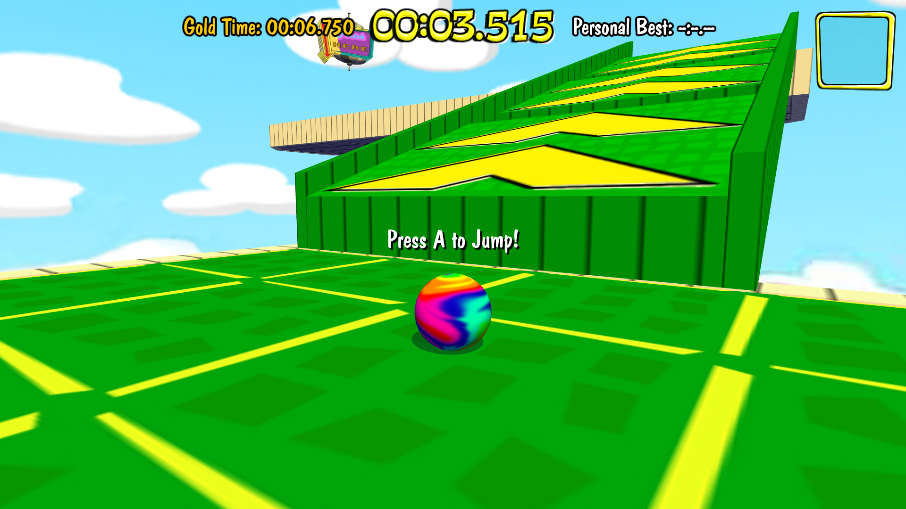

# Marble Blast Gold: Controller Roller

Marble Blast Gold with full controller support.

Controller Roller is an opinionated desktop fork of [MBHaxe](https://github.com/RandomityGuy/MBHaxe), designed for playing Marble Blast Gold from a couch and TV, a handheld, or a controller-first desktop setup. Every menu and gameplay action is accessible without needing a keyboard or mouse.

It runs on Linux and Windows. Linux builds ship as a portable directory and an AppImage; the Windows build is a portable folder holding `marblegame.exe`, one DLL, and the game data. Both keep their settings alongside the game rather than in a system location.



## Features

- Full controller navigation across the menus, dialogs, level selector, options, gameplay, and end-game screens
- Xbox-based button prompts that replace keyboard instructions when a controller is active
- A pointer-finger cursor designed to fit the original game's art style
- Fractional GUI scaling based on monitor resolution, affecting UI and HUD
- A redesigned controller-only options menu with camera sensitivity, Y-axis inversion, anti-aliasing, display, audio, field-of-view, and rewind controls
- Borderless fullscreen, windowed play, controller-adjustable sliders, and gamepad-friendly rewind controls
- Improved texture filtering that reduces distant level shimmer while retaining detail
- Sequential level play from the end-game screen without needing to return to the level select menu each time
- Continuous level browsing across Beginner, Intermediate, and Advanced categories, stopping only at the end of the game
- Level names moved below the preview image for improved readability
- Gold time and personal best printed either side of the in-game timer
- A gold badge burst and fanfare when a run beats the level's gold time
- A rebuilt end-game screen led by the run's final time, with the qualify and gold times check marked for how the run did against them
- Bonus time shown as the subtraction it is, on levels that hand it out
- A single personal best in place of the three name high score table, with a gold badge over levels already taken gold in the level select



The level selector can move continuously through every level in the game, instead of abruptly stopping at the end of a difficulty set. Completing a level also offers the next level directly, making a full playthrough feel like one uninterrupted sequence.

Each level shows its qualify time, its gold time, and your personal best in the corner of its panel, in the same colours the in-game timer uses. Levels already taken gold are marked with a check beside the gold time and a gold badge over the preview image, so a pass down the list shows what is left to do.

## Times, gold, and personal bests



The gold time and your personal best are printed either side of the timer during play, so the target is on screen while you are chasing it. Finishing under the gold time bursts a gold badge out of the middle of the screen with a fanfare.

The end-game screen is built around the time the run is judged on. The final time is the headline, drawn with the gameplay timer's own digits, and the level's gold and qualify times each carry a check or a cross for how the run did against them. Beating your stored time raises a new personal best banner.

Levels that award bonus time show the working above the result: the elapsed time, the bonus time subtracted from it, and then the final time. Every value comes out of whole milliseconds, so the subtraction adds up exactly as printed.

A single personal best replaces the original three-name high score table, in both this screen and the level selector. Every time belongs to whoever is holding the controller, and a run that beats the stored time is saved without opening a text entry dialog a gamepad cannot type into.

## Controller-first options



The options interface has been simplified around the settings relevant to controller play. All navigation paths are explicit, instead of relying on approximate spatial selection.



Camera sensitivity supports fine adjustment across a wide range, including very slow movement at the low end. Y-axis inversion is available directly beside it.

## In-game prompts



Help messages automatically use Xbox-style controller labels, such as A, B, X, Y, shoulder buttons, and triggers, instead of displaying keyboard bindings.
At some point down the line I may add controller type detection and PlayStation prompt support.

## Linux configuration

Both the portable build and AppImage store configuration in:

```text
~/.config/controller-roller/
```

If `XDG_CONFIG_HOME` is set, the directory is `$XDG_CONFIG_HOME/controller-roller` instead. The game stores its normal preferences in `settings.json` and creates an editable `settings.ini` for manual overrides.

To choose the player name your personal best times are saved under, edit `settings.ini` and set:

```ini
username=username
```

A non-empty `username` takes priority over the name saved in `settings.json` and the detected `USER`, `LOGNAME`, or `USERNAME` environment variable. Restart the game after changing it.

The AppImage stores its versioned writable game-data and converted-resource cache under `$XDG_CACHE_HOME/controller-roller` (default: `~/.cache/controller-roller`). Each build's copy is keyed by a hash of the game data it ships, so a build with changed assets always unpacks a fresh copy instead of reusing an older one. Cache directories from builds you no longer run can be deleted.

## Windows configuration

The Windows build is portable and keeps `settings.json` and `settings.ini` in its own folder, next to `marblegame.exe`. Put it somewhere writable rather than under `Program Files`. The `username` setting works the same way it does on Linux.

## Building for Linux

Both platforms are built from Linux on top of HashLink and SDL, and both need the MBHaxe Haxe, Heaps, HashLink, and native library toolchain.

The included script generates the C sources, links the native executable, and deploys a self-contained directory containing the executable, game data, HashLink plugins, and their non-system shared-library dependencies:

```bash
./compile-linux.sh
```

Run the packaged build with `run-mbg.sh`. Keep the extracted directory together; the launcher and executable load the bundled libraries relative to their own location. Linux's C ABI and the host graphics-driver libraries remain supplied by the operating system so GPU driver discovery continues to work.

Release builds also produce `MBG-Controller-Roller-x86_64.AppImage`, a single executable containing that entire portable directory. To create it locally, install `appimagetool` and run:

```bash
MBG_BUILD_APPIMAGE=1 ./compile-linux.sh
```

This one-command local route requires a baseline x86-64 build environment. Architecture-optimized distributions such as CachyOS should use the Steam Linux Runtime release environment/CI described below.

The packaging stages can also be run independently. `build-portable.sh` takes an already compiled executable and recursively collects its non-system ELF dependencies; `build-appimage.sh` turns that portable directory into a single AppImage:

```bash
MBG_BINARY=/path/to/marblegame \
MBG_LIBRARY_DIR=/path/to/hashlink/lib \
MBG_DIST_DIR="$PWD/dist/MBHaxe-Gold-Linux" \
./build-portable.sh

APPIMAGETOOL=/path/to/appimagetool \
MBG_PORTABLE_DIR="$PWD/dist/MBHaxe-Gold-Linux" \
MBG_APPIMAGE_OUTPUT="$PWD/dist/MBG-Controller-Roller-x86_64.AppImage" \
./build-appimage.sh
```

`build-portable.sh` rejects executables or libraries whose ELF metadata requires x86-64-v2, v3, or v4. This prevents a build made on an architecture-optimized distribution from crashing with `SIGILL` on an older computer. It also detects Steam Runtime's SDL2 compatibility layer and includes its dynamically loaded SDL3 dependency. The release build links the data-channel module's C++ runtime internally while leaving graphics-driver support libraries to the host, avoiding runtime mismatches with the target computer's GPU driver. Official release artifacts are built in the Steam Linux Runtime container used by CI; use that environment for broadly compatible releases. A local CachyOS build is suitable for testing on the build computer but may intentionally fail this portability check because its system startup objects require x86-64-v3.

By default, it expects the toolchain at `/home/cachy/mbhaxe-toolchain` and packages to `dist/MBHaxe-Gold-Linux`. Both locations can be overridden:

```bash
MBHAXE_TOOLCHAIN=/path/to/toolchain \
MBG_DEPLOY_DIR=/path/to/game \
./compile-linux.sh
```

The underlying dependencies are:

- Haxe 4.3 or newer
- [RandomityGuy's Heaps fork](https://github.com/RandomityGuy/heaps)
- [RandomityGuy's HashLink fork and SDL bindings](https://github.com/RandomityGuy/hashlink)
- [hxDatachannel](https://github.com/RandomityGuy/hxDatachannel)
- SDL2 and libuv development libraries

## Building for Windows

The Windows build is cross-compiled from Linux with MinGW-w64, and produces a portable folder holding just the executable, one DLL, and the game data:

```text
dist/MBG-Controller-Roller-Windows/
├── marblegame.exe
├── OpenAL32.dll
└── data/
```

The cross-compilation toolchain is built once. It needs `cmake`, `ninja`, `curl`, and `git`, plus the same MBHaxe toolchain the Linux build uses:

```bash
./setup-windows-toolchain.sh
```

That script downloads a MinGW-w64 cross compiler (unpacking it into the toolchain directory, so no root access is needed) unless one is already installed, fetches a static Windows SDL2, builds OpenAL Soft, and produces static builds of HashLink, its native modules, and libdatachannel. Then build the game as often as needed:

```bash
./compile-windows.sh
```

Both scripts default to a toolchain at `/home/cachy/mbhaxe-toolchain`, keep their Windows-specific parts in its `windows` subdirectory, and accept overrides:

```bash
MBHAXE_TOOLCHAIN=/path/to/toolchain \
MBG_WIN_TOOLCHAIN=/path/to/windows-toolchain \
MBG_WIN_DEPLOY_DIR=/path/to/game \
./compile-windows.sh
```

Everything the game needs is linked into `marblegame.exe`, including SDL2, HashLink and its native modules, libdatachannel, and the C and C++ runtimes, so the only libraries it loads are the ones Windows itself provides. `compile-windows.sh` fails the build if the finished executable depends on anything else. OpenAL Soft is the deliberate exception: it is LGPL, so it ships beside the game as a DLL instead of being linked in. That DLL is built here rather than taken from MSYS2, whose build would drag in three more GCC runtime DLLs.

The generated HashLink C code is compiled at `-O0`, matching the Linux build. At higher optimization levels the game starts, creates its window, and then renders nothing. Unoptimized HL/C also has very large stack frames, so the executable reserves a 64MB stack instead of the 2MB default; HashLink creates its threads with a stack size of 0, so they inherit it. Without that, Windows kills the game during startup and Wine reports stack overflows on several threads.

The MBHaxe HashLink fork is only built with MSVC upstream, so `patches/hashlink-mingw.patch` fixes the MSVC-only constructs its sources rely on: SEH keywords, a cast used as an assignment target, a header included under a name that only matches on a case-insensitive filesystem, and the entry point. `setup-windows-toolchain.sh` applies it to a private copy of the sources and never modifies the shared toolchain checkout.

Two copies of Mbed TLS end up in the same binary, because `ssl.hdll` bundles 2.7 while libdatachannel bundles 3.6. Separate `.hdll` libraries each keep their own copy, but a single executable would silently bind one library's calls to the other version's code, so the setup script renames the older copy's symbols out of the way and verifies that none are left shared. It rewrites each archive member individually and deliberately avoids partial-linking them into one object with `ld -r`, which renames symbols just as well but mangles the per-function `.pdata` and `.xdata` associations that Windows stack unwinding depends on.

Damaged unwind tables are worth guarding against, because nothing about them shows up at link time: the game starts normally and then spins forever the first time an exception unwinds through the affected code, which looks like a freeze seconds after the main menu appears. `compile-windows.sh` checks every `.pdata` entry in the finished executable and fails the build if any of them is unusable.

Mac, Android, and WebGL builds are untested here, but they should function?? ymmv

## Project background

Controller Roller is forked from MBHaxe and remains built on its Haxe port of Marble Blast Gold. MBHaxe incorporates marble physics work from [OpenMBU](https://github.com/MBU-Team/OpenMBU), along with game logic developed independently and adapted with permission from the [Marble Blast web port](https://github.com/Vanilagy/MarbleBlast).

This personal fork was developed with some AI assistance, but with extensive care and attention put towards QA. don't like, don't use!

## Reporting issues

If you find an issue that's specific to this fork (i.e. something related to controller support), please [open an issue](https://github.com/evanclue/mbg-controller-roller/issues) with a short description, reproduction steps, and a screenshot or log when useful.

Feel free to open a PR if you wanna contribute :3
